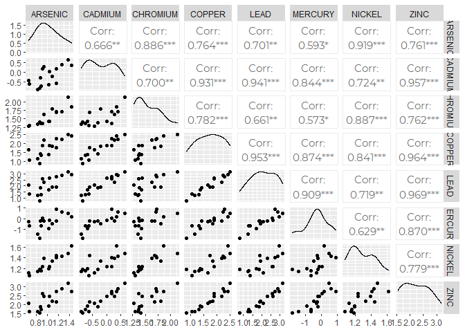
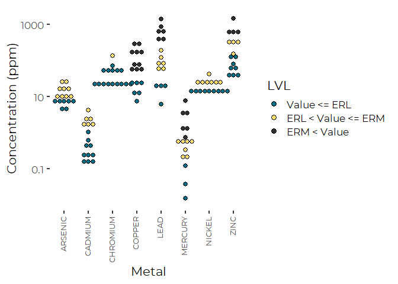

Exploratory analysis of Sediment Toxicity Data : Metals
================
Curtis C. Bohlen, Casco Bay Estuary Partnership
7/16/2020

  - [Install Libraries](#install-libraries)
  - [Load Basic Data](#load-basic-data)
  - [Chemical Parameters](#chemical-parameters)
  - [Extract Metals Data Only](#extract-metals-data-only)
  - [We Have NO Non-detects](#we-have-no-non-detects)
  - [Initial graphics](#initial-graphics)
      - [Pairs Plot](#pairs-plot)
      - [Metals by Samples](#metals-by-samples)
  - [Load Screening Values Data](#load-screening-values-data)
      - [Convert to a look-up table](#convert-to-a-look-up-table)
  - [Final Plot](#final-plot)
      - [Add Screaning Levels to Plot](#add-screaning-levels-to-plot)
  - [Conclusion](#conclusion)


# Install Libraries

``` r
library(readxl)
library(tidyverse)
```

    ## -- Attaching packages --------------------------------------------- tidyverse 1.3.0 --

    ## v ggplot2 3.3.2     v purrr   0.3.4
    ## v tibble  3.0.3     v dplyr   1.0.0
    ## v tidyr   1.1.0     v stringr 1.4.0
    ## v readr   1.3.1     v forcats 0.5.0

    ## -- Conflicts ------------------------------------------------ tidyverse_conflicts() --
    ## x dplyr::filter() masks stats::filter()
    ## x dplyr::lag()    masks stats::lag()

``` r
library(GGally)
```

    ## Registered S3 method overwritten by 'GGally':
    ##   method from   
    ##   +.gg   ggplot2

``` r
library(maxLik)
```

    ## Loading required package: miscTools

    ## 
    ## Please cite the 'maxLik' package as:
    ## Henningsen, Arne and Toomet, Ott (2011). maxLik: A package for maximum likelihood estimation in R. Computational Statistics 26(3), 443-458. DOI 10.1007/s00180-010-0217-1.
    ## 
    ## If you have questions, suggestions, or comments regarding the 'maxLik' package, please use a forum or 'tracker' at maxLik's R-Forge site:
    ## https://r-forge.r-project.org/projects/maxlik/

``` r
library(CBEPgraphics)
load_cbep_fonts()
```

# Load Basic Data

``` r
sibfldnm <- 'Derived_Data'
parent <- dirname(getwd())
sibling <- file.path(parent,sibfldnm)
fn <- 'working_data.xls'

the_data <- read_excel(paste(sibling,fn, sep='/'), 
    sheet = "Combined", col_types = c("skip", 
        "text", "skip", "skip", "skip", 
        "skip", "skip", "skip", "skip", 
        "text", "text", "numeric", "text", 
        "numeric", "text", "numeric", "numeric", 
        "text", "text", "text", "skip", 
        "skip", "skip", "skip", "skip", 
        "numeric", "numeric", "skip", "skip", 
        "skip", "skip", "skip", "skip", 
        "skip")) %>%
  mutate(SAMPLE_ID = factor(SAMPLE_ID,
                            levels = c("CSP-1", "CSP-2", "CSP-3",
                                       "CSP-4", "CSP-5", "CSP-6",
                                       "CSP-7", "CSP-7D", "CSP-8",
                                       "CSP-9", "CSP-10", "CSP-11",
                                       "CSP-12", "CSS-13", "CSP-14",
                                       "CSS-15")))
```

# Chemical Parameters

``` r
metals.names <- read_excel(paste(sibling,fn, sep='/'), sheet = "Metals", skip = 3) %>%
  select(1) %>%
  slice(1:8) #%>%
```

    ## New names:
    ## * Result -> Result...3
    ## * Qual -> Qual...4
    ## * Result -> Result...5
    ## * Qual -> Qual...6
    ## * Result -> Result...7
    ## * ...

``` r
  #mutate(PARAMETER_NAME = substr(PARAMETER_NAME, 1, nchar(PARAMETER_NAME)-7))
(metals.names <- metals.names$PARAMETER_NAME)
```

    ## [1] "ARSENIC, TOTAL"  "CADMIUM, TOTAL"  "CHROMIUM, TOTAL" "COPPER, TOTAL"  
    ## [5] "MERCURY, TOTAL"  "NICKEL, TOTAL"   "LEAD, TOTAL"     "ZINC, TOTAL"

# Extract Metals Data Only

We filter to selected parameters defined in a list of parameters. Notice
the second and third filters, which remove QA/QC samples.

We have some duplicate samples (for CSP-6, CSP-15 - all measurements -
CSP-10 - TOC data only - and CSP-9 - all observations EXCEPT TOC), so we
want to calculate average values across multiple samples.

The following reads in data and assigns the value of the reporting limit
to data that was below the detection limits. That cues up later steps
that make different analytic assumptions.

We also need to strip the “, TOTAL” From the end of each metal name in
the\_data.

``` r
metals_data_long <- the_data %>%
  filter (the_data$PARAMETER_NAME %in% metals.names) %>%
  mutate(PARAMETER_NAME = sub(', TOTAL', '', PARAMETER_NAME)) %>%
  filter(is.na(`%_RECOVERY`)) %>%
  filter(SAMPLE_ID != 'QC') %>%
  mutate(CONCENTRATION = ifelse(is.na(CONCENTRATION) & LAB_QUALIFIER == 'U',
                                REPORTING_LIMIT, CONCENTRATION)) %>%
  group_by(SAMPLE_ID, PARAMETER_NAME) %>%
  summarize(CONCENTRATION = mean(CONCENTRATION, na.rm=TRUE),
            censored = sum(LAB_QUALIFIER=='U', na.rm=TRUE))
```

    ## `summarise()` regrouping output by 'SAMPLE_ID' (override with `.groups` argument)

``` r
metals_data <- metals_data_long %>%
  spread(key = PARAMETER_NAME, value = CONCENTRATION) %>%
  rowwise() %>%
  mutate(totmetals = sum(c(`ARSENIC`, `CADMIUM`,  `CHROMIUM`,
                           `COPPER`,`MERCURY`,  `NICKEL`, `LEAD`,
                           `ZINC`), na.rm = TRUE))
```

# We Have NO Non-detects

``` r
any(metals_data_long$censored>0)
```

    ## [1] FALSE

# Initial graphics

## Pairs Plot

``` r
ggpairs(log10(metals_data[2:9]), progress=FALSE)
```

<!-- --> Most
metals appear highly correlated.

## Metals by Samples

Given high correlations, it is not a surprise that sites high in one
metal tend to be high in other metals.

``` r
tmp <- metals_data
tmp$SAMPLE_ID <- reorder(tmp$SAMPLE_ID, tmp$totmetals, mean, na.rm = TRUE)
#levels(tmp$SAMPLE_ID)

tmp <- tmp %>% gather(key = 'metal', value = 'Concentration', 3:10) %>%
  mutate(metals = factor(metal)) %>%
  mutate(metals = reorder(metal, Concentration, mean))
 
  
plt <- ggplot(tmp, aes(x=as.numeric(SAMPLE_ID), y = Concentration, color = metals)) +
  geom_line(lwd = 1) +
  scale_x_continuous(breaks = c(1:16-0.25), labels = levels(tmp$SAMPLE_ID),
                     minor_breaks = FALSE) +
  xlab('Site ID') +
  ylab('Log10 of Concentration (mg/kg)') +
  theme_cbep() +
  theme(axis.text.x = element_text(angle = 90, hjust = 1)) +
  theme(panel.grid = element_blank()) 
plt
```

<!-- -->

# Load Screening Values Data

The names in the screening values table have to exactly match the order
of levels for the Chemicals in the metals data if we want the final
graphics to plot them in order.

``` r
fn= "Marine_Sediment_Screening_Values_simplified.xlsx"
 SQUIRTS <- read_excel(paste(sibling,fn, sep = '/')) %>%
   select(1:8) %>%
   filter(Chemical %in% names(metals_data)) %>%
   mutate(Chemical = factor(Chemical)) #%>%
   #filter(! is.na(Chemical))
 
 SQUIRTS.LONG <- SQUIRTS %>%
   gather(key = 'type', value = 'value', -Chemical) %>%
   mutate(value = as.numeric(value)) %>%
   filter(type %in% c('ERL','ERM'))
```

## Convert to a look-up table

Now, I convert the SQIRTS data to a look-up table, by converting the
Chemical column to row names. While this is discouraged in the
tidyverse, it is slightly more convenient to implement a look-up this
way. Note that all this accomplishes is to slightly simplify how I
specify which row(s) I’m interested in. The following creates an
indicator that shows whether specific measurements are above certain
screening levels.

our interest here focuses on the “Effects Range Low” and “Effects Range
Medium” screening criteria. WE focus on those only because we have used
them in the past.

``` r
lookup <- SQUIRTS %>%
  column_to_rownames(var = 'Chemical')
  
metals_data_long <- metals_data_long %>%
  mutate(ERL = lookup[PARAMETER_NAME, 'ERL']) %>%
  mutate(ERM = lookup[PARAMETER_NAME, 'ERM']) %>%
  mutate(LVL = factor(ifelse(is.na(ERL), 'N/A',
                             ifelse(CONCENTRATION<=ERL, 'Value <= ERL',
                                   ifelse(CONCENTRATION<=ERM,
                                          'ERL < Value <= ERM','ERM < Value'))),
                      levels = c('N/A','Value <= ERL',
                                 'ERL < Value <= ERM','ERM < Value')))
```

# Final Plot

``` r
plt <- ggplot(tmp, aes(x = metals, y = Concentration)) +
  # primary geom can be geom_boxplot,  geom_violin", Geom_point, or geom_dotplot
  # Combinations are also interesting. Note that I  turned off  display of
  # outliers in the boxlot code, which is appropriate if you overlay points.
  
  #geom_boxplot(outlier.shape = NA) +
  #geom_violin() +
  #geom_point(size = 1, alpha = 0.5) +
  
  geom_dotplot(binaxis='y', stackdir = "center",
                dotsize = 0.75, color = 'blue1') +
 
  theme_cbep() +
  theme(axis.text.x = element_text(size = 10, hjust= 1, vjust = 0.25, angle = 90)) + 
  scale_y_log10(breaks = c(0.1, 10, 1000), labels = c('0.1', '10', '1000')) +
  xlab('Metal')+ ylab('Concentration (ppm)')
plt
```

    ## `stat_bindot()` using `bins = 30`. Pick better value with `binwidth`.

<!-- -->

## Add Screaning Levels to Plot

``` r
plt + 
  geom_point(data = SQUIRTS.LONG,
             mapping = aes(x=Chemical, y=value, color = type), shape = 3)+
  scale_color_manual(values = cbep_colors(), name = 'Criteria') +
  scale_y_log10(breaks = c(0.1, 10, 1000, 100000),
                labels = c('0.1', '10', '1000', '100,000'))
```

    ## Scale for 'y' is already present. Adding another scale for 'y', which will
    ## replace the existing scale.

    ## `stat_bindot()` using `bins = 30`. Pick better value with `binwidth`.

<!-- -->

``` r
  # theme(legend.position = 'None')
```

So, absolutely consistently, metals levels are below relevant screening
levels by an order of magnitude or more.

# Conclusion

All Metals are below Levels of Concern, by about an order of magnitude.
So probably not worth showing on a graphic. Interest here may be
increased if plots with high metals are also high in other contaminants.
