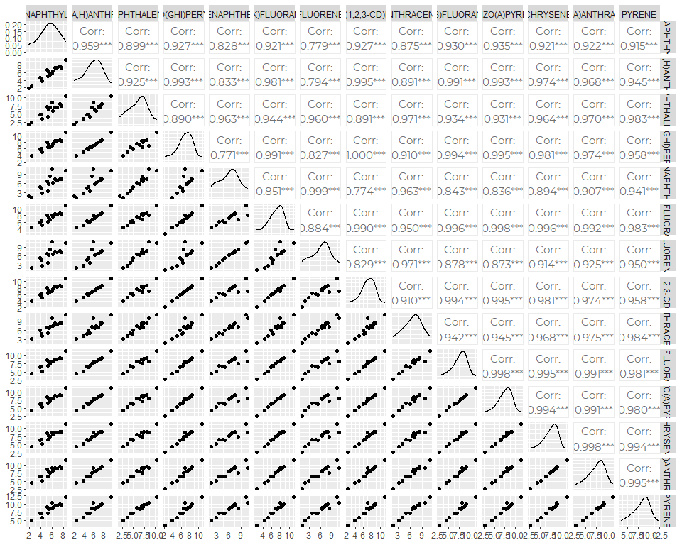
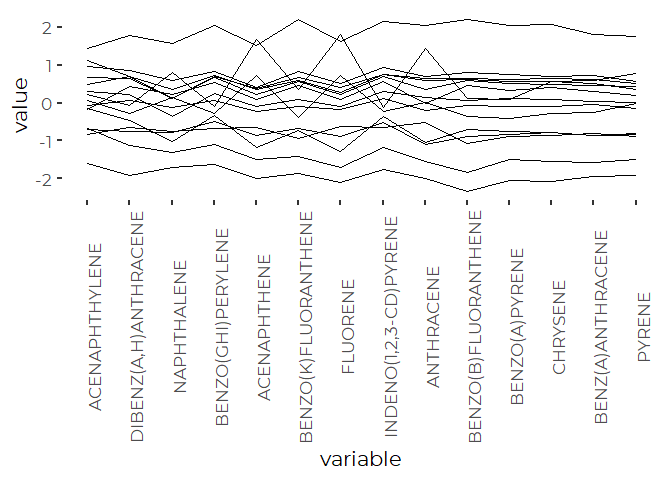
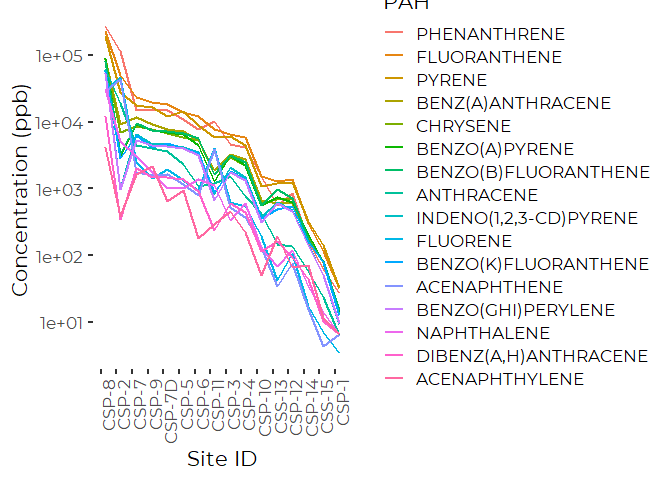
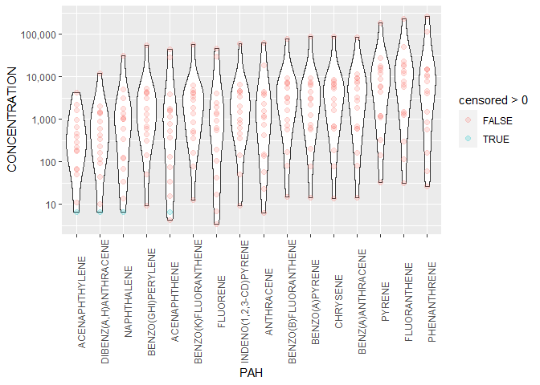
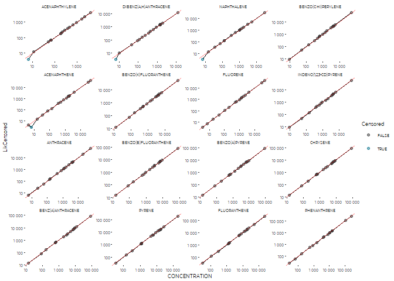
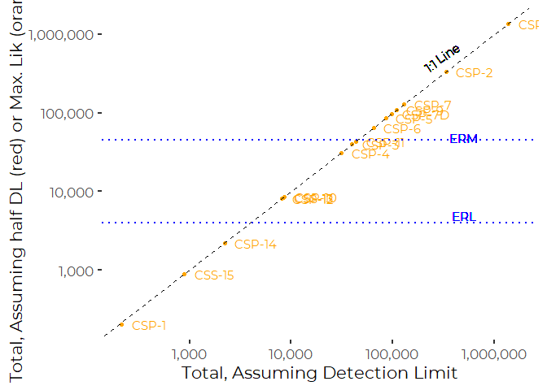

Exploratory analysis of Sediment Toxicity Data : PAHs
================
Curtis C. Bohlen, Casco Bay Estuary Partnership
7/16/2020

  - [Install Libraries](#install-libraries)
  - [Load Data](#load-data)
      - [List Chemical Parameters](#list-chemical-parameters)
      - [Extract PAH Data](#extract-pah-data)
  - [Exploratory Analysis](#exploratory-analysis)
      - [Pairs Plot](#pairs-plot)
      - [Check for Non-detects](#check-for-non-detects)
      - [Parralel Coordinates Plot](#parralel-coordinates-plot)
      - [Alternate Graphic](#alternate-graphic)
      - [Correlations](#correlations)
  - [Analysis of Non Detects](#analysis-of-non-detects)
      - [Distribution Graphic showing
        NDs](#distribution-graphic-showing-nds)
      - [Alternate Estimates of Sum of
        PAHs](#alternate-estimates-of-sum-of-pahs)
      - [Applying to the PAHs data](#applying-to-the-pahs-data)
  - [Graphic Showing ND Handling](#graphic-showing-nd-handling)
  - [Total PAHs](#total-pahs)
      - [Graphic Comparing ND Methods](#graphic-comparing-nd-methods)


# Install Libraries

``` r
library(readxl)
library(tidyverse)
```

    ## -- Attaching packages --------------------------------------- tidyverse 1.3.0 --

    ## v ggplot2 3.3.2     v purrr   0.3.4
    ## v tibble  3.0.3     v dplyr   1.0.0
    ## v tidyr   1.1.0     v stringr 1.4.0
    ## v readr   1.3.1     v forcats 0.5.0

    ## -- Conflicts ------------------------------------------ tidyverse_conflicts() --
    ## x dplyr::filter() masks stats::filter()
    ## x dplyr::lag()    masks stats::lag()

``` r
library(GGally)  # here, provides pairs plot and parallel Coordinated Plot
```

    ## Registered S3 method overwritten by 'GGally':
    ##   method from   
    ##   +.gg   ggplot2

``` r
library(maxLik)  # Simple Maximum likelihood estimation from arbitrary
```

    ## Loading required package: miscTools

    ## 
    ## Please cite the 'maxLik' package as:
    ## Henningsen, Arne and Toomet, Ott (2011). maxLik: A package for maximum likelihood estimation in R. Computational Statistics 26(3), 443-458. DOI 10.1007/s00180-010-0217-1.
    ## 
    ## If you have questions, suggestions, or comments regarding the 'maxLik' package, please use a forum or 'tracker' at maxLik's R-Forge site:
    ## https://r-forge.r-project.org/projects/maxlik/

``` r
                 # Likelihood functions.

library(CBEPgraphics)
load_cbep_fonts()

library(LCensMeans)
```

# Load Data

``` r
sibfldnm <- 'Derived_Data'
parent <- dirname(getwd())
sibling <- paste(parent,sibfldnm, sep = '/')
fn <- 'working_data.xls'

the.data <- read_excel(paste(sibling,fn, sep='/'), 
    sheet = "Combined", col_types = c("skip", 
        "text", "skip", "skip", "skip", 
        "skip", "skip", "skip", "skip", 
        "text", "text", "numeric", "text", 
        "numeric", "text", "numeric", "numeric", 
        "text", "text", "text", "skip", 
        "skip", "skip", "skip", "skip", 
        "numeric", "numeric", "skip", "skip", 
        "skip", "skip", "skip", "skip", 
        "skip")) %>%
  mutate(SAMPLE_ID = factor(SAMPLE_ID, levels = c("CSP-1", "CSP-2", "CSP-3", "CSP-4", "CSP-5", "CSP-6",
                                                  "CSP-7", "CSP-7D", "CSP-8", "CSP-9", "CSP-10", "CSP-11",
                                                  "CSP-12", "CSS-13", "CSP-14", "CSS-15")))
```

## List Chemical Parameters

PAH Anylates are listed in a separate tab in the original Excel
spreadsheet. Here we pull them into a vector, for later use.

``` r
pah.names <- read_excel(paste(sibling,fn, sep='/'),
                         sheet = "PAHs", skip = 3) %>%
  select(1) %>%
  slice(1:16)
```

    ## New names:
    ## * Result -> Result...3
    ## * Qual -> Qual...4
    ## * Result -> Result...5
    ## * Qual -> Qual...6
    ## * Result -> Result...7
    ## * ...

``` r
(pah.names <- pah.names$PARAMETER_NAME)
```

    ##  [1] "ACENAPHTHENE"           "ACENAPHTHYLENE"         "ANTHRACENE"            
    ##  [4] "BENZ(A)ANTHRACENE"      "BENZO(A)PYRENE"         "BENZO(B)FLUORANTHENE"  
    ##  [7] "BENZO(GHI)PERYLENE"     "BENZO(K)FLUORANTHENE"   "CHRYSENE"              
    ## [10] "DIBENZ(A,H)ANTHRACENE"  "FLUORANTHENE"           "FLUORENE"              
    ## [13] "INDENO(1,2,3-CD)PYRENE" "NAPHTHALENE"            "PHENANTHRENE"          
    ## [16] "PYRENE"

## Extract PAH Data

We filter down to selected parameters defined in the list of PAH names.
The second and third filters remove QA/QC samples.

We have some duplicate samples: 1. CSP-6, CSP-15 - all measurements 2,
CSP-10 - TOC only 3. CSP-9 - all observations EXCEPT TOC To address
duplicate samples, we calculate average values.

In addition, the following reads in data and assigns the value of the
reporting limit to data that was below that limit. Since we retain a
flag value indicating which observation we treated this way, this does
NOT imply that the detection limit is the most appropriate estimate of
the (unobserved) left censored value.

We handle censored values in more detail, below.

``` r
pah.data.long <- the.data %>%
  filter (the.data$PARAMETER_NAME %in% pah.names) %>%
  filter(is.na(`%_RECOVERY`)) %>%
  filter(SAMPLE_ID != 'QC') %>%
  mutate(CONCENTRATION = ifelse(is.na(CONCENTRATION) & LAB_QUALIFIER == 'U', REPORTING_LIMIT, CONCENTRATION)) %>%
  group_by(SAMPLE_ID, PARAMETER_NAME) %>%
  summarize(CONCENTRATION = mean(CONCENTRATION, na.rm=TRUE),
            censored = sum(LAB_QUALIFIER=='U', na.rm=TRUE)) %>%
  ungroup() %>%
  rename(PAH = PARAMETER_NAME) %>%
  mutate(PAH = factor(PAH)) %>%
  mutate(PAH = reorder(PAH, CONCENTRATION, function(x) mean(x, na.rm=TRUE)))
```

    ## `summarise()` regrouping output by 'SAMPLE_ID' (override with `.groups` argument)

``` r
pah.data <- pah.data.long %>%
  spread(key = PAH, value = CONCENTRATION) %>%
  rowwise() %>%
  mutate(totpah = sum(c(ACENAPHTHENE, ACENAPHTHYLENE, `BENZ(A)ANTHRACENE`, `BENZO(A)PYRENE`,
                      `BENZO(B)FLUORANTHENE`, `BENZO(GHI)PERYLENE`, `BENZO(K)FLUORANTHENE`,
                      CHRYSENE, `DIBENZ(A,H)ANTHRACENE`, FLUORANTHENE, FLUORENE,
                      `INDENO(1,2,3-CD)PYRENE`, NAPHTHALENE, PHENANTHRENE, PYRENE), na.rm = TRUE))
```

# Exploratory Analysis

## Pairs Plot

``` r
ggpairs(log(pah.data[3:16]), progress=FALSE, na.rm=TRUE)
```

<!-- -->
Observations: 1. That shows the very high correlation among all the
PAHs. We need to make sure that’s not due to hidden correlations of
detection limits. 2. Distributions are not too far from lognormal,
although still slightly skewed.

## Check for Non-detects

There are only a few.

``` r
pah.data.long %>% select(SAMPLE_ID, PAH, censored) %>%
  group_by(PAH) %>%
  summarize(detects = sum(censored==0, na.rm=TRUE),
            nondetects = sum(censored>0, na.rm=TRUE),
            .groups='drop')
```

    ## # A tibble: 16 x 3
    ##    PAH                    detects nondetects
    ##    <fct>                    <int>      <int>
    ##  1 ACENAPHTHYLENE              15          1
    ##  2 DIBENZ(A,H)ANTHRACENE       15          1
    ##  3 NAPHTHALENE                 15          1
    ##  4 BENZO(GHI)PERYLENE          16          0
    ##  5 ACENAPHTHENE                15          1
    ##  6 BENZO(K)FLUORANTHENE        16          0
    ##  7 FLUORENE                    16          0
    ##  8 INDENO(1,2,3-CD)PYRENE      16          0
    ##  9 ANTHRACENE                  16          0
    ## 10 BENZO(B)FLUORANTHENE        16          0
    ## 11 BENZO(A)PYRENE              16          0
    ## 12 CHRYSENE                    16          0
    ## 13 BENZ(A)ANTHRACENE           16          0
    ## 14 PYRENE                      16          0
    ## 15 FLUORANTHENE                16          0
    ## 16 PHENANTHRENE                16          0

## Parralel Coordinates Plot

``` r
ggparcoord(log(pah.data[3:16]), scale='robust' ) + 
theme_cbep() +
  theme(axis.text.x = element_text(angle = 90))
```

<!-- --> This
is just another way of showing the high level of correlation among
chemical parameters. If a sample is high in one PAH, it tends to be high
in most / all.

## Alternate Graphic

``` r
tmp <- pah.data.long %>%
  select(-censored) %>%
  mutate(SAMPLE_ID = fct_reorder(SAMPLE_ID, CONCENTRATION, function(x) mean(-x))) %>%
  mutate(PAH = fct_reorder(PAH, CONCENTRATION, function(x) mean(-x)))

plt <- ggplot(tmp, aes(x=as.numeric(SAMPLE_ID), y = CONCENTRATION, color = PAH)) +
  geom_line(lwd = 1) +
  scale_x_continuous(breaks = c(1:16-0.25), labels = levels(tmp$SAMPLE_ID), minor_breaks = FALSE) +
  scale_y_log10() +
  xlab('Site ID') +
  ylab('Concentration (ppb)') +
  theme_cbep() +
  theme(axis.text.x = element_text(angle = 90, hjust = 1)) +
  theme(panel.grid = element_blank()) 
plt
```

<!-- -->

## Correlations

Quantitative analysis confirms high correlations. Results are similar
with Kendall’s Tau or Pearsons’ r.

``` r
knitr::kable(cor(pah.data[3:18],
                 use='pairwise',
                 method = 'spearman'), digits = 2)
```

|                        | ACENAPHTHYLENE | DIBENZ(A,H)ANTHRACENE | NAPHTHALENE | BENZO(GHI)PERYLENE | ACENAPHTHENE | BENZO(K)FLUORANTHENE | FLUORENE | INDENO(1,2,3-CD)PYRENE | ANTHRACENE | BENZO(B)FLUORANTHENE | BENZO(A)PYRENE | CHRYSENE | BENZ(A)ANTHRACENE | PYRENE | FLUORANTHENE | PHENANTHRENE |
| :--------------------- | -------------: | --------------------: | ----------: | -----------------: | -----------: | -------------------: | -------: | ---------------------: | ---------: | -------------------: | -------------: | -------: | ----------------: | -----: | -----------: | -----------: |
| ACENAPHTHYLENE         |           1.00 |                  0.92 |        0.81 |               0.92 |         0.81 |                 0.90 |     0.77 |                   0.92 |       0.90 |                 0.92 |           0.92 |     0.92 |              0.90 |   0.88 |         0.85 |         0.86 |
| DIBENZ(A,H)ANTHRACENE  |           0.92 |                  1.00 |        0.84 |               0.99 |         0.78 |                 0.98 |     0.74 |                   0.99 |       0.87 |                 0.98 |           0.99 |     0.94 |              0.94 |   0.87 |         0.87 |         0.85 |
| NAPHTHALENE            |           0.81 |                  0.84 |        1.00 |               0.81 |         0.95 |                 0.86 |     0.94 |                   0.81 |       0.93 |                 0.87 |           0.84 |     0.92 |              0.93 |   0.94 |         0.97 |         0.94 |
| BENZO(GHI)PERYLENE     |           0.92 |                  0.99 |        0.81 |               1.00 |         0.73 |                 0.99 |     0.78 |                   1.00 |       0.89 |                 0.99 |           1.00 |     0.96 |              0.95 |   0.91 |         0.89 |         0.87 |
| ACENAPHTHENE           |           0.81 |                  0.78 |        0.95 |               0.73 |         1.00 |                 0.80 |     1.00 |                   0.73 |       0.93 |                 0.79 |           0.76 |     0.85 |              0.86 |   0.90 |         0.94 |         0.95 |
| BENZO(K)FLUORANTHENE   |           0.90 |                  0.98 |        0.86 |               0.99 |         0.80 |                 1.00 |     0.83 |                   0.99 |       0.92 |                 0.99 |           0.99 |     0.97 |              0.96 |   0.94 |         0.94 |         0.92 |
| FLUORENE               |           0.77 |                  0.74 |        0.94 |               0.78 |         1.00 |                 0.83 |     1.00 |                   0.78 |       0.94 |                 0.83 |           0.80 |     0.88 |              0.89 |   0.92 |         0.95 |         0.96 |
| INDENO(1,2,3-CD)PYRENE |           0.92 |                  0.99 |        0.81 |               1.00 |         0.73 |                 0.99 |     0.78 |                   1.00 |       0.89 |                 0.99 |           1.00 |     0.96 |              0.95 |   0.91 |         0.89 |         0.87 |
| ANTHRACENE             |           0.90 |                  0.87 |        0.93 |               0.89 |         0.93 |                 0.92 |     0.94 |                   0.89 |       1.00 |                 0.93 |           0.91 |     0.97 |              0.98 |   0.98 |         0.99 |         0.98 |
| BENZO(B)FLUORANTHENE   |           0.92 |                  0.98 |        0.87 |               0.99 |         0.79 |                 0.99 |     0.83 |                   0.99 |       0.93 |                 1.00 |           1.00 |     0.98 |              0.97 |   0.95 |         0.94 |         0.91 |
| BENZO(A)PYRENE         |           0.92 |                  0.99 |        0.84 |               1.00 |         0.76 |                 0.99 |     0.80 |                   1.00 |       0.91 |                 1.00 |           1.00 |     0.97 |              0.96 |   0.93 |         0.91 |         0.89 |
| CHRYSENE               |           0.92 |                  0.94 |        0.92 |               0.96 |         0.85 |                 0.97 |     0.88 |                   0.96 |       0.97 |                 0.98 |           0.97 |     1.00 |              0.99 |   0.98 |         0.97 |         0.95 |
| BENZ(A)ANTHRACENE      |           0.90 |                  0.94 |        0.93 |               0.95 |         0.86 |                 0.96 |     0.89 |                   0.95 |       0.98 |                 0.97 |           0.96 |     0.99 |              1.00 |   0.97 |         0.98 |         0.96 |
| PYRENE                 |           0.88 |                  0.87 |        0.94 |               0.91 |         0.90 |                 0.94 |     0.92 |                   0.91 |       0.98 |                 0.95 |           0.93 |     0.98 |              0.97 |   1.00 |         0.99 |         0.97 |
| FLUORANTHENE           |           0.85 |                  0.87 |        0.97 |               0.89 |         0.94 |                 0.94 |     0.95 |                   0.89 |       0.99 |                 0.94 |           0.91 |     0.97 |              0.98 |   0.99 |         1.00 |         0.99 |
| PHENANTHRENE           |           0.86 |                  0.85 |        0.94 |               0.87 |         0.95 |                 0.92 |     0.96 |                   0.87 |       0.98 |                 0.91 |           0.89 |     0.95 |              0.96 |   0.97 |         0.99 |         1.00 |

# Analysis of Non Detects

Here we continue the analysis, with an explicit effort to model
non-detects. We do this, as elsewhere, using a simple maximum likelihood
estimation procedure to calculate an estimated distribution for each
contaminant, and then replace the NDs with an estimate of the
conditional mean suggested by those distributions.

## Distribution Graphic showing NDs

What kind of distribution do we actually have?

``` r
plt <- ggplot(pah.data.long, aes(PAH, CONCENTRATION)) +
  geom_violin() +
  geom_point(aes(color = censored>0), alpha = 0.2, size=2) +
  scale_y_log10(labels = scales::comma) +
  theme(axis.text.x = element_text(angle=90))
  
plt
```

<!-- --> So,
only a handful of non-detects, all quite low. Other evidence shows the
non-detects are all from one site….

## Alternate Estimates of Sum of PAHs

We want to focus on analysis of the sum of PAHs, because all PAHs are
highly correlated. The question is, how do we best handle the
non-detects. Often in environmental analyses, non-detects are replaced
by zero, by the detection limit, or by half the detection limit, but
none of those conventions rests on strong statistical principles. We
instead implement a method that estimates the (unobserved) value of
non-detects using a conditional mean of censored observations derived
from a maximum likelihood procedure.

The idea is to fit a maximum likelihood model to the data assuming a
censored lognormal distribution. With a lognormal density in hand, we
can estimate a conditional mean of for “unobserved” observations below a
the detection limit by sampling from the underlying lognormal
distribution 1000 times (or more) and calculating a mean.

We developed functions for implementing this procedure. Those functions
have been incorporated into a small package, ‘LCensMeans’ to facilitate
use in CBEP State of the Bay Analyses.

See the help files in the LCensMeans package for more explanation, or
read the R Notebook “Conditional Means of Censored Distributions”, where
we developed the basic approach.

The LCenMeans package is in active development in pre-release form, so
there is no guarantee that the user interface will not change. The
following code worked as of July 2020.

## Applying to the PAHs data

Note the use of “mutate” after the group\_by() so that the data-frame is
not collapsed to the grouping variables, as it would be by summary().

The calculations involved are random, so if you want to get exactly the
same results, you need to set the random number seed with set.seed()

``` r
dat2 <- pah.data.long %>%
  group_by(PAH) %>%
  mutate(LikCensored = sub_conditional_means(CONCENTRATION, censored>0)) %>%
  mutate(HalfDL = ifelse(censored>0, CONCENTRATION/2, CONCENTRATION)) %>%
  ungroup()

res2 <- dat2 %>%
  group_by(SAMPLE_ID) %>%
  summarize(LNtotPAH = sum(LikCensored, na.rm=TRUE),  # Not sure why I needed
                                                      # the na.rm=TRUE here...
            halfDLtotPAH = sum(HalfDL),
            totPAH = sum(CONCENTRATION))
```

    ## `summarise()` ungrouping output (override with `.groups` argument)

# Graphic Showing ND Handling

``` r
ggplot(dat2, aes(CONCENTRATION,LikCensored)) + geom_line() + geom_point(aes(color = censored>0), alpha = 0.5) + 
  geom_abline(intercept = 0, slope= 1, alpha = 0.5, color = 'red') + 
  scale_x_log10(labels = scales::label_number()) +
  scale_y_log10(labels = scales::label_number()) +
  facet_wrap('PAH', scales = 'free') +
  theme_cbep(base_size=6) +
  scale_color_manual(values = cbep_colors2(), name = 'Censored') #+
```

    ## Warning: Removed 1 rows containing missing values (geom_point).

<!-- -->

``` r
  #theme(strip.text=element_text(size=5))
```

The first panel shows random variation for a parameter with no
detections, but variable detection limits. Note that the “corrected”
estimates are all small and only vary in the fourth decimal place, well
below differences that can possibly matter.

# Total PAHs

## Graphic Comparing ND Methods

``` r
ggplot(res2, aes(x=totPAH))+
  geom_point(aes(y=halfDLtotPAH), color = 'red') +
  geom_point(aes(y=LNtotPAH), color = 'orange') +
  geom_text(aes(y=LNtotPAH, label = SAMPLE_ID), color = 'orange',
            hjust = 0, nudge_x = 0.1) +

  geom_abline(intercept = 0, slope = 1, lty = 2) +
  geom_text(aes(x=300000, y=520000, label = '1:1 Line'), angle = 35) +
  geom_hline(yintercept = 4022, color = 'blue', lty=3, size=1) +    #ERL
  geom_text(aes(x=500000, y=4900, label = 'ERL'), color = 'blue') +
  geom_hline(yintercept = 44792, color = 'blue', lty=3, size=1) +     #ERM
  geom_text(aes(x=500000, y=49000, label = 'ERM'), color = 'blue') +
  xlab('Total, Assuming Detection Limit') +
  ylab('Total, Assuming half DL (red) or Max. Lik (orange)') +
  scale_y_log10(label=scales::comma) +
  scale_x_log10(label=scales::comma) +  
  theme_cbep()
```

<!-- -->

So, we see no evidence that which estimate of non-detects we use has any
impact on our conclusions. Here, where non-detects are few, maximum
likelihood estimates are close to the detection limits, which are well
below most observations.
